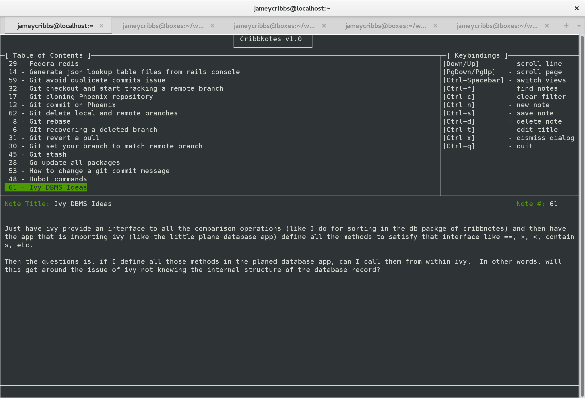

Keywords: Golang, go, cui, notes

### CribbNotes - A console-user-interface application that allows you to take and search for notes

CribbNotes is a simple note taking application written in Go.  It uses the awesome cui library, gocui (https://github.com/jroimartin/gocui).  I can't thank the developers of gocui enough for building such a wonderful, useful library.  There is an experimental vim-mode available that is still pretty rudimentary.  To enable vim-mode instead of the normal navigation and edit mode, pass "--vim"after you specify the data directory when you execute the program.

  

### How to install

~~~
go get github.com/jameycribbs/cribbnotes_cui
~~~

- go get any dependencies
- go build cribbnotes_cui.go
- open a terminal, cd to the directory where the executable resides and run it, making sure you supply a command-line argument for the location of the data directory
- if the data directory does not exist, it will be created

### Contributions welcome!

Pull requests/forks/bug reports all welcome, and please share your thoughts, questions and feature requests in the [Issues] section or via [Email].

[Email]: mailto:jamey.cribbs@gmail.com
[Issues]: https://github.com/jameycribbs/cribbnotes_cui/issues

